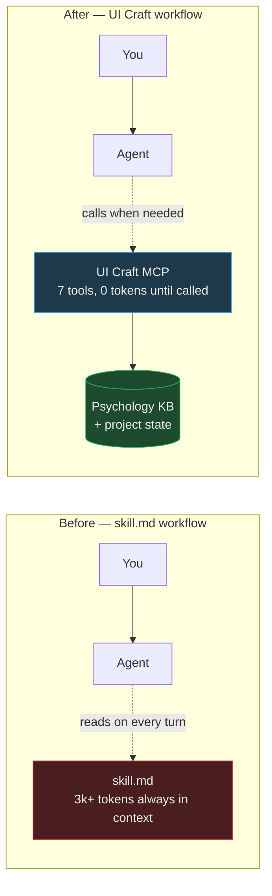
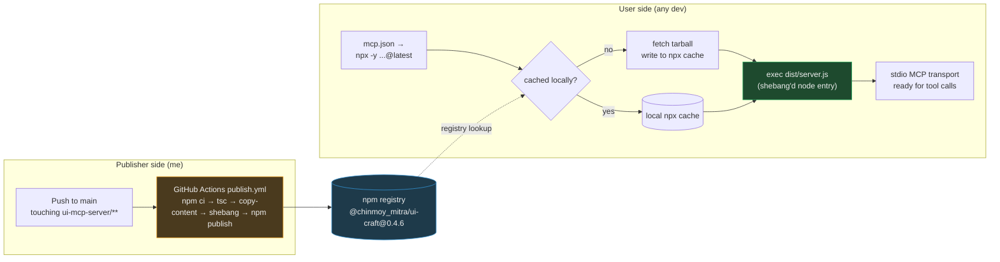
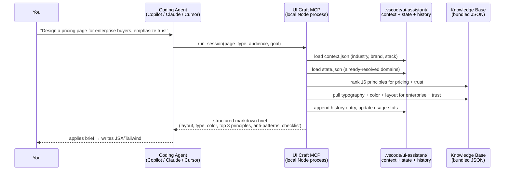
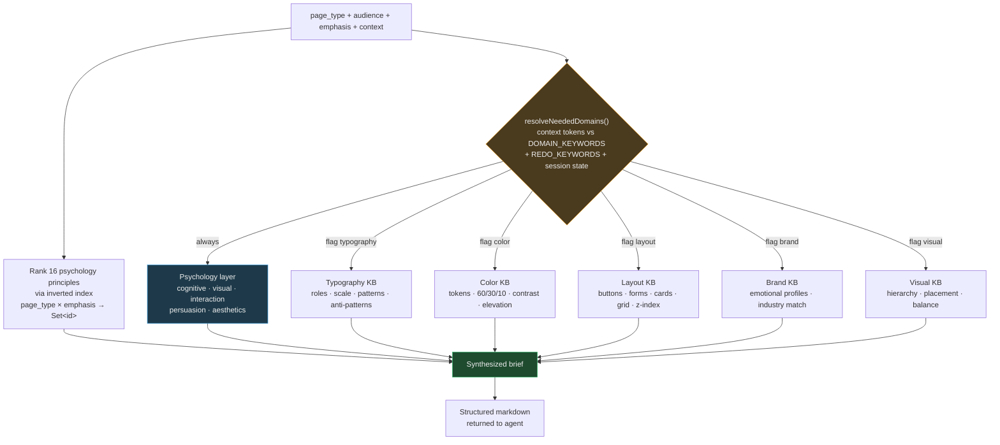
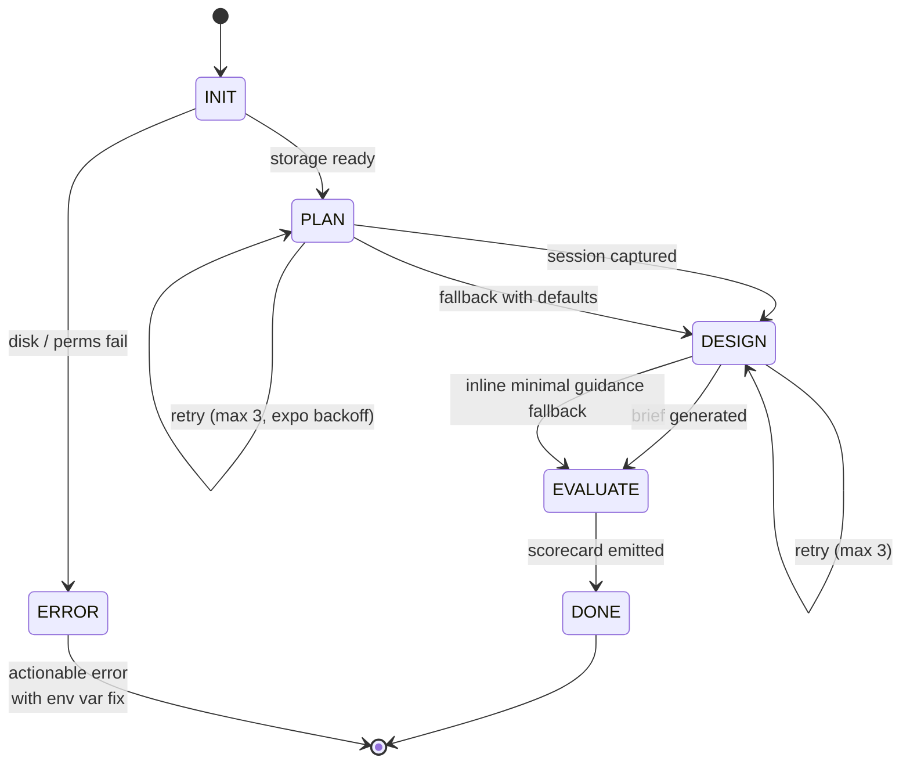
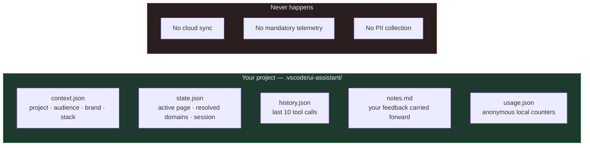

# I built an MCP server that gives your coding agent a design brain — and it never leaves your machine.

> **UI Craft** — a psychology-backed UI design assistant for GitHub Copilot, Claude, and Cursor.
> Open source · Local-first · Works with any MCP-compatible agent.
> `npx -y @chinmoy_mitra/ui-craft@latest`

---

## The problem I actually had

When I started building full-stack apps, I'd do what most backend-first devs do — perfect the API, obsess over schemas, then throw a UI on top at the end. Those UIs were toys.

I didn't know where to put a button. I didn't know how color combinations affected trust. I didn't understand CTAs, typography, whitespace, or the F-pattern. I hadn't heard of Hick's Law, Fitts's Law, or cognitive load balancing. Nothing.

So I did the reasonable thing — I started reading. Books, blog posts, research papers, Refactoring UI, Laws of UX, Cognitive Load Theory. Great content. **Terrible retention.**

The moment I was in a coding session with Copilot or Claude, everything I'd read evaporated. I'd type "make the hero section better" and get back… a slightly different hero section. I was steering a very capable agent with very vague instructions, because I couldn't hold the principles in my head while I was writing code.

## Why `skill.md` files weren't the answer

The obvious workaround is a `skill.md` (or an `AGENTS.md`, or a `.cursorrules`, or a `copilot-instructions.md`) — dump the design rules into a markdown file and hope the agent reads it.

I tried it. It half-works, but a few things bothered me:

1. **Context window tax.** Every `skill.md` line lives in your context window on every turn. A serious design guide is 3–5k tokens minimum. That's a lot of budget spent on rules the agent may or may not need for the current task.
2. **It's not adaptive.** A landing page for a fintech dashboard and an onboarding flow for a consumer app need different principles — Halo Effect matters for one, Cognitive Load for the other. A single flat file can't route.
3. **It doesn't scale across projects.** Every new repo, I'd re-copy the file, tweak it, forget which version was current.
4. **Sharing is fragile.** If I hand you my `skill.md`, you get my project's biases baked in — audience, industry, stack, tone — none of which fit yours.

So I started asking a different question: what if the agent could *call* a design expert instead of *reading* one?

## Why MCP is the right primitive

Coding agents already work beautifully with tools. `grep`, `read_file`, `web_search` — the agent doesn't preload their contents into context. It calls them when it needs them, gets back exactly the answer, and moves on.

That's the shape a design brain wants:

- **Universal** — one server, any agent, any project.
- **On-demand** — knowledge loaded only when the agent asks.
- **Adaptive** — the *same* server gives different answers for a B2B dashboard vs a consumer landing page.
- **Stateful** — remembers your project's audience, stack, brand, must-keeps.
- **Private** — everything stays on disk. No cloud calls.

That's [Model Context Protocol](https://modelcontextprotocol.io). And that's what I built on.

---

## The mental model



Context window stays lean. The agent pulls exactly what it needs, exactly when it needs it.

---

## What UI Craft actually is

A single Node.js MCP server, installable with one line of config, that exposes **7 tools** to your agent:

| Tool | What it does |
|---|---|
| `design_page` | Returns a full design strategy for a page type — layout, typography, color, top psychology principles, common mistakes, checklist. |
| `start_session` | MCQ-style onboarding — captures working mode, surface, goal, audience, tone, density, change behavior. |
| `run_session` | The orchestrator. Runs `INIT → PLAN → DESIGN → EVALUATE` end-to-end. All fields optional; it infers what it can. |
| `get_project_context` | Reads your workspace's stored context (audience, industry, brand, stack, custom rules). |
| `set_project_context` | Updates that context. Persistent per project. |
| `get_session_state` | Returns current stage, resolved domains, and open questions. |
| `get_usage_stats` | Local, anonymous — tool call counts, page types designed. No PII, never leaves your disk. |

Under the hood it draws on:

- **16 cognitive & UX principles** — Gestalt, Fitts's Law, Hick's Law, Miller's Law, Cognitive Load, Halo Effect, Anchoring Bias, F-Pattern, Preattentive Vision, Affordance, Feedback Latency, and more — grouped into cognitive / visual / interaction / persuasion / aesthetics.
- **A domain-partitioned knowledge base** — typography (roles, scale, patterns, anti-patterns), color (tokens, 60/30/10, contrast, elevation), layout (buttons, forms, cards, spacing, grid, z-index), brand emotional profiles, accessibility, interaction motion, UX copy, and per-industry guidance.
- **Per-project state** — audience, industry, brand tokens, device targets, must-keeps, tone. Fed into every recommendation.

---

## Shipped as an npm package (that's the whole delivery story)

There is no installer. No binary. No update dance. The user config is one JSON block that points at `npx -y @chinmoy_mitra/ui-craft@latest`. That's the entire distribution contract.

Why that shape matters, engineering-wise:

- **`bin` + shebang = zero-friction entry.** `package.json` maps `"ui-craft": "dist/server.js"`, and a tiny `add-shebang.js` post-build step prepends `#!/usr/bin/env node` to that file. `npx` sees an executable JS entry and just runs it — no wrapper scripts, no path setup.
- **No post-install hooks.** Nothing runs on the user's machine at install time. No native builds. No download-more-stuff scripts. That's a security posture as much as a speed posture — supply-chain surface stays flat.
- **Content ships bundled.** `copy-content.js` walks `src/content/` and mirrors every JSON into `dist/content/` during build. When you get the package, you get the KB. No runtime fetches, no CDN, no versioning drift between code and data.
- **`@latest` is opt-in auto-update; pinning `@0.4.6` is opt-in stability.** The user picks. `npx` handles the cache, invalidates it when the registry has a newer version, and starts from cache when it doesn't.
- **CI is the release button.** `.github/workflows/publish.yml` triggers on any push to `main` that touches `ui-mcp-server/**` — `npm ci` → `npm run build` (`tsc` + `copy-content` + `add-shebang`) → `npm publish`. No manual step, no forgotten `dist/`, no "whoops shipped without content".



First run costs a network round-trip. Every run after that is a cache hit + a Node process spawn — low tens of milliseconds. And because the whole KB is inside the tarball, the moment the process boots it's ready to answer.

---

## How a single call works



The agent gets a structured brief, not a wall of rules. It uses that brief to write code with intent.

---

## The KB is a graph, not a folder

The naive design is a folder of JSON files loaded on every call, then filtered in memory. That's what v0.1 did. It worked — until the KB grew, the principle count crossed a dozen, and every call was rescanning strings that hadn't changed since the process started.

The current shape treats the KB as a **two-layer graph** with an index built once and reused for the entire server lifetime.



**Layer 1 — Psychology principles.** 16 rules across five categories. Always ranked, never skipped. This is the reasoning lens — the answer to "why does this work on a human brain."

**Layer 2 — Domain KBs.** Typography, color, layout, brand, visual, plus accessibility / interaction / copy / industry / design-system on the edges. Individually gated. A KB only loads and only shows up in the output if the input signals ask for it.

Three engineering choices make that graph cheap to walk:

**Inverted indexes, built once.** On the first call, we walk the 16 principles once and populate two `Map<string, Set<string>>` structures: `_pageTypeIndex` (page_type → principle ids) and `_emphasisIndex` (emphasis → principle ids). A ranking query becomes a small-set intersection with O(1) `.has()` probes, not a linear scan over every principle. A single `_indexesBuilt = true` flag makes it idempotent — subsequent calls skip the entire build step.

**Three-state singleton cache per KB file.** Each domain loader has a module-level variable that starts as `false`, transitions to `null` when the file is missing on disk, or holds the parsed JSON once loaded:

```ts
let _kbTypographySpec: KBTypographySpec | null | false = false
// false → not attempted yet
// null  → tried, file absent (won't retry — no repeated ENOENT)
// T     → parsed, cached for the server lifetime
```

The missing-file state is remembered. We don't hammer the disk hoping the file appeared. A present file is deserialized exactly once, then handed to every subsequent call by reference.

**Domain routing from freeform context.** `resolveNeededDomains()` tokenizes the user's `context` string against `DOMAIN_KEYWORDS` (which signal "typography", "color", etc.) and `REDO_KEYWORDS` ("redo color", "revisit typography"). It returns a `DomainFlags` object — one boolean per domain — that decides which subgraph nodes activate. In progressive session mode, `state.json.resolved_domains` is subtracted from the flags before routing, so an already-answered domain doesn't get emitted again unless the user explicitly asks to redo it.

Net effect on the hot path: zero disk reads after warmup, O(index) principle ranking, and only the KB slices the input actually needs get serialized into the response.

---

## The orchestrator is a real state machine



Every stage retries with 50 / 100 / 200 ms exponential backoff. If a stage exhausts retries, you get a structured fallback — **never a silent failure**. This is the difference between "the agent got confused and moved on" and "the agent got a partial answer with a note about what went wrong and kept going."

---

## Everything stays local



- **Feedback lives.** Tell the agent "I don't like this heading weight for enterprise pages" — it lands in `notes.md` and shows up in the next brief for the same project.
- **`install_id` is a random UUID.** Not tied to you. Stored locally so *your* usage stats work; nothing is sent anywhere.
- **Opt-in telemetry only.** If you want to share anonymous stats, set `UI_CRAFT_TELEMETRY_URL`. Off by default. HTTPS-only. No PII in the payload.

---

## Setup (30 seconds)

**Prereq:** Node 18+ (`node --version`).

### VS Code (GitHub Copilot / Claude in VS Code)

Create `.vscode/mcp.json` in your project:

```json
{
  "servers": {
    "ui-craft": {
      "type": "stdio",
      "command": "npx",
      "args": ["-y", "@chinmoy_mitra/ui-craft@latest"]
    }
  }
}
```

Restart VS Code. Flip Copilot Chat to **Agent mode**. Done.

### Claude Code

Add to `~/.claude/settings.json`:

```json
{
  "mcpServers": {
    "ui-craft": {
      "command": "npx",
      "args": ["-y", "@chinmoy_mitra/ui-craft@latest"]
    }
  }
}
```

### Cursor

Add to `~/.cursor/mcp.json` (Mac / Linux) or `%APPDATA%\Cursor\mcp.json` (Windows):

```json
{
  "mcpServers": {
    "ui-craft": {
      "command": "npx",
      "args": ["-y", "@chinmoy_mitra/ui-craft@latest"]
    }
  }
}
```

No install step. `npx` fetches the package on first run and caches it.

---

## Using it (a real example)

Once connected, talk to your agent normally:

```
Design a landing page for a B2B SaaS product focused on trust.
Audience is enterprise buyers. Stack is Next.js + Tailwind.
```

The agent calls `run_session`. You get back something like this (abbreviated):

```markdown
## Intent Signature
page_type: landing_page | emphasis: trust | mode: greenfield
Anchor principles: Halo Effect · F-Pattern · Miller's Law

## Layout
Hero: H1 + one-sentence value prop + one CTA.
Social proof strip immediately below (logos, no testimonials yet).
3-column feature grid. Pricing anchor. FAQ. Footer CTA.
Max-width 1200px, 12-column grid, 24px gutters.

## Typography
Serif or semi-serif display for headings — signals credibility for
enterprise audiences (Halo Effect via type authority).
Body: 16px / 1.6 line-height / max 65ch.
H1: 48–56px desktop, 32px mobile.

## Color
Primary: deep blue (trust signal, banking / enterprise anchor).
60% neutral surface / 30% primary / 10% accent.
Contrast: body text ≥ 7:1 on background. Never gray-on-gray.

## Top Psychology Principles
### Halo Effect
A single positive trait (visual polish, credible typography)
biases the buyer's perception of every other trait...

### F-Pattern
Enterprise buyers scan. Top-left quadrant is where trust cues
must live — logo, headline, credibility badge...

### Miller's Law
7±2 chunks max. Feature grid: 3 or 6, never 8.
Pricing tiers: 3, never 4 or 5.

## Common Mistakes to Avoid
- Multiple competing CTAs above the fold
- Rainbow gradient CTAs (destroys trust for enterprise)
- Body copy under 14px
- Testimonials without a company logo

## Checklist
[ ] Squint test: is the CTA still visible at 20% zoom?
[ ] Contrast passes WCAG AA on all text
[ ] One primary CTA per section, max two
[ ] Social proof visible without scrolling
```

The agent then writes JSX with that brief in hand. Same prompt without UI Craft gets you "a nice hero section." Same prompt with UI Craft gets you a *reasoned* hero section.

---

## Engineering for cost, not just speed

Cost in an MCP server is measured in three currencies: build time, cold-start time, and — the one you actually feel — output tokens returned to the agent. Every token in the response sits in the model's context for the rest of the conversation.

### Build cost: a 150× fix, not a speedup trick

The MCP SDK's `server.tool(name, desc, shape, handler)` uses deeply generic overloads. Registering seven tools naively triggered **~27.8 million type instantiations**, drove the TypeScript compiler to ~6 GB of memory, and took **~197 seconds** to build. Not a build — a hostage negotiation.

The fix was small and mechanical: a non-generic `registerTool()` wrapper that binds `server.tool` once and re-declares the handler signature explicitly. TypeScript stops trying to infer through the deep generics; the seven `registerTool(...)` calls resolve trivially.

| Metric | Before | After |
|---|---:|---:|
| Build time | ~197 s | **~1.3 s** |
| Peak compiler memory | ~6 GB | **~163 MB** |
| Type instantiations | ~27.8 M | negligible |

### Cold start: no lazy-init races

`initContextSystem()` runs in `main()` before `StdioServerTransport` connects. `.vscode/ui-assistant/` and its five files exist before the first tool call is even parsed. No first-call latency spike, no half-initialized state visible to the agent.

### Hot path: boring by design

- **KB loaders.** Singleton, three-state. Zero disk reads after the first hit.
- **Principle ranking.** Two `Set` lookups + intersection over precomputed indexes. Sub-millisecond.
- **Freeform context matching.** `buildTermSet()` tokenizes the input once into a `Set<string>`; every subsequent domain check is `.has()` — no repeated substring scans across the string.
- **Retry.** Synchronous, busy-wait ≤200 ms with 50 / 100 / 200 ms backoff. No async overhead because the MCP request chain is synchronous anyway; introducing promises would add scheduling latency for no reliability gain at these delay bounds.
- **Storage init.** Proactive at boot, but each file is only rewritten when its content changes.

### Output cost: the one that matters most

Every KB section emitted becomes a permanent tenant of the agent's context. On a five-call design iteration, the difference between five full briefs and one full brief + four focused diffs is the difference between a bloated context and a clean one.

That's what progressive session mode is for. After the first `run_session` resolves typography for a page, subsequent calls on the same page skip the entire Typography KB section unless the user says `redo typography`. The Intent Signature block at the top of every response acts as the reminder: same page, same emphasis, only the new domain got recomputed. The model's attention stays on the current question instead of re-parsing the same font-scale table five times.

All together: **~1.3 s builds, sub-second cold start, hot-path calls in low tens of milliseconds, and a monotonically shrinking response size as a session progresses.**

---

## What it's still missing (this is where I need help)

The system is stable at v0.4.6 and covers layout, typography, color, brand, visual, accessibility, and interaction *statically* — but it doesn't yet have a proper KB for **transitions and animation**. Motion is where a lot of "premium feel" lives, and the rules are non-trivial: timing curves, reduced-motion, page-type-appropriate micro-interactions, hover intent, easing choices, and when *not* to animate.

**If you're a UI/UX expert with a strong motion background — or you've thought seriously about how to encode design knowledge for AI — I'd love to talk.** Two ways to help:

1. **Contribute the KB.** Open a PR against `ui-mcp-server/src/content/kb/interaction/`. The schema is small and JSON-native; there's a working `interaction_patterns.json` you can extend.
2. **Teach me how to teach the agent.** If you have a system for turning tacit design judgment into structured rules, that conversation is probably worth more than the code.

Roadmap items I'm already sizing:

- `analyze_ui` — score an existing JSX/HTML surface for hierarchy, contrast, grouping, density, affordance.
- `improve_ui` — turn "make this better" into concrete, ranked, reasoned moves.
- `choose_palette` — brand-mood-to-color-system generator.
- Remote-hostable server for browser agents (claude.ai etc.).

---

## Links

- 📦 npm — https://www.npmjs.com/package/@chinmoy_mitra/ui-craft
- 🐙 GitHub — https://github.com/Chinmoy17/UI_Assitant_AI
- 🐛 Issues — https://github.com/Chinmoy17/UI_Assitant_AI/issues
- 🧠 MCP spec — https://modelcontextprotocol.io

---

## If you're going to try it

Give it your ugliest side-project. Set the project context first (`set_project_context` with your industry, audience, stack), then ask your agent to redesign a page. Compare the output to what you'd get from the same prompt without UI Craft. That gap is the whole point.

And if it doesn't nail it the first time — leave feedback in the chat. It'll remember, for this project, on your machine, next time.

---

*Built by Chinmoy Mitra. Open source. Apache 2.0. Not a startup — just a tool I wished existed.*
