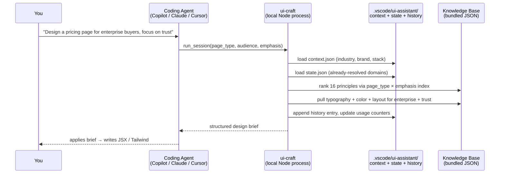

# UI Craft — a psychology-backed design brain for your coding agent

> An open-source MCP server that plugs into GitHub Copilot, Claude Code, and Cursor. Instead of "make it look better," your agent gets a structured, research-backed design brief — layout, typography, color, top psychology principles, common mistakes, and a checklist — tailored to your project's audience, industry, brand, and stack.

[](https://www.npmjs.com/package/@chinmoy_mitra/ui-craft)
[](https://nodejs.org)
[](#license)

📖 **Deep-dive with diagrams & engineering write-up:** [LINKEDIN_POST.md](./LINKEDIN_POST.md)
🏗️ **Contributor / architecture guide:** [ARCHITECTURE.md](./ARCHITECTURE.md)

---

## The problem this solves

Every full-stack dev has been here: you build a great backend, then slap a UI on top and hope it looks "good." It never does. You read *Refactoring UI*, bookmark *Laws of UX*, keep a `skill.md` full of design rules — and then in the middle of a coding session, all of it evaporates. "Make the hero section better" gets you a slightly different hero section.

`skill.md` files half-work but they're a context-window tax on every turn, they're not adaptive to page type, they don't scale across projects, and sharing them bakes in your project's biases.

**UI Craft** treats design knowledge the way modern agents already treat `grep`, `read`, and `web_search` — as a **tool the agent calls when it needs it**, not context it carries around.

---

## What it does — concretely

**You say:**

```
Design a landing page for a B2B SaaS product focused on trust. Audience is enterprise buyers.
```

**Your agent calls `run_session` and gets back:**

```markdown
## Intent Signature
page_type: landing_page | emphasis: trust | mode: greenfield
Anchor principles: Halo Effect · F-Pattern · Miller's Law

## Layout
Hero: H1 + one-sentence value prop + one CTA.
Social proof strip immediately below (logos, no testimonials yet).
3-column feature grid. Pricing anchor. FAQ. Footer CTA.
Max-width 1200px, 12-column grid, 24px gutters.

## Typography
Serif or semi-serif display for headings — signals credibility for enterprise
audiences (Halo Effect via type authority).
Body: 16px / 1.6 line-height / max 65ch.
H1: 48–56px desktop, 32px mobile.

## Color
Primary: deep blue (trust signal, banking / enterprise anchor).
60% neutral surface / 30% primary / 10% accent.
Contrast: body text ≥ 7:1 on background. Never gray-on-gray.

## Top Psychology Principles
### Halo Effect
A single positive trait (visual polish, credible typography) biases the buyer's
perception of every other trait...

### F-Pattern
Enterprise buyers scan. Top-left quadrant is where trust cues must live —
logo, headline, credibility badge...

### Miller's Law
7±2 chunks max. Feature grid: 3 or 6, never 8. Pricing tiers: 3, never 4 or 5.

## Common Mistakes to Avoid
- Multiple competing CTAs above the fold
- Rainbow gradient CTAs (destroys trust for enterprise)
- Body copy under 14px
- Testimonials without a company logo

## Checklist
[ ] Squint test: is the CTA still visible at 20% zoom?
[ ] Contrast passes WCAG AA on all text
[ ] One primary CTA per section, max two
[ ] Social proof visible without scrolling
```

Your agent then writes JSX / Tailwind with that brief in hand — with intent, not vibes.

---

## What it looks like once installed


*UI Craft's seven tools sit alongside VS Code's built-in agent tools (edit, execute, read, search, web) and any other MCP servers you've installed. Your agent picks them automatically based on what you ask.*

---

## Install (30 seconds)

**Requirements:** Node.js 18+ (`node --version`).

### 🚀 Fastest — let your agent install it

Copy this repo's URL:

```
https://github.com/Chinmoy17/UI_Assitant_AI
```

Paste it into your coding agent's chat and say:

> **"Read this repo's README and set up the MCP server for my workspace."**

Modern agents (Copilot, Claude Code, Cursor) will parse the setup block below, write the correct `mcp.json` file, and prompt you to reload. That's it.

### ⚙️ Manual — one JSON block

<details open>
<summary><b>VS Code (GitHub Copilot / Claude in VS Code)</b></summary>

Create `.vscode/mcp.json` in your project:

```json
{
  "servers": {
    "ui-craft": {
      "type": "stdio",
      "command": "npx",
      "args": ["-y", "@chinmoy_mitra/ui-craft@latest"]
    }
  }
}
```

Restart VS Code. Flip Copilot Chat to **Agent mode**.

Alternative via command palette: `Ctrl+Shift+P` → **MCP: Add Server** → command `npx`, args `-y @chinmoy_mitra/ui-craft@latest`, name `ui-craft`.

</details>

<details>
<summary><b>Claude Code</b></summary>

Add to `~/.claude/settings.json`:

```json
{
  "mcpServers": {
    "ui-craft": {
      "command": "npx",
      "args": ["-y", "@chinmoy_mitra/ui-craft@latest"]
    }
  }
}
```

Or run `/mcp` in Claude Code and paste the block above.

</details>

<details>
<summary><b>Cursor</b></summary>

Add to `~/.cursor/mcp.json` (Mac / Linux) or `%APPDATA%\Cursor\mcp.json` (Windows):

```json
{
  "mcpServers": {
    "ui-craft": {
      "command": "npx",
      "args": ["-y", "@chinmoy_mitra/ui-craft@latest"]
    }
  }
}
```

Or use `Cursor Settings → MCP → Add new MCP server`.

</details>

No install step. `npx` fetches the package on first run and caches it. Content is bundled — no runtime downloads.

---

## Verify it's running

**Two ways:**

1. `Ctrl+Shift+P` → **MCP: List Servers** — `ui-craft` should be marked **Running**.
2. `Ctrl+Shift+P` → **Chat: Configure Tools** — expand the `ui-craft` group and you'll see all seven tools ready to be called (same view as the screenshot above).

If it's missing, check `Output → MCP` in VS Code for the server logs.

---

## The 7 tools

| Tool | What it does | Example prompt (in Agent mode) |
|---|---|---|
| `run_session` | Full orchestrated session: `INIT → PLAN → DESIGN → EVALUATE`. All fields optional — infers what it can from stored context, defaults the rest. **Start here.** | *"Design an onboarding flow for first-time consumers, focused on clarity."* |
| `design_page` | Single-shot design brief for a specific page type + emphasis. Returns layout, typography, color, top psychology principles, common mistakes, checklist. | *"What layout should I use for a settings page focused on speed?"* |
| `start_session` | MCQ-style onboarding. Captures working mode, surface, goal, audience, tone, density, change behavior — writes to session state. | *"Start a UI Craft session — I'm redesigning an existing dashboard for admins."* |
| `set_project_context` | Persist project-wide context (industry, audience, brand tokens, stack, must-keeps) so every future recommendation is tailored. | *"Set project context: industry fintech, audience portfolio managers, primary color #0F52BA, stack Next.js + Tailwind, dark theme."* |
| `get_project_context` | Read the current stored context. | *"Show me the current UI Craft project context."* |
| `get_session_state` | Current stage, resolved KB domains, pending questions. Useful to check what's already covered before another call. | *"What has UI Craft already resolved for this page?"* |
| `get_usage_stats` | Local anonymous counters — tool call counts, page types designed. **No PII, never leaves your disk.** | *"Show my UI Craft usage stats."* |

---

## How it works



Three engineering choices under the hood:

- **Inverted indexes.** 16 psychology principles indexed once by `page_type × emphasis → Set<id>`. Ranking is a small-set intersection, not a scan.
- **Three-state singleton KB cache.** Every domain file is `false` (untried) → `null` (missing) → parsed JSON. Zero disk reads after the first hit; missing files aren't re-checked.
- **Progressive session mode.** Once typography is resolved for a page, subsequent calls skip that KB section unless you say `redo typography`. Fewer tokens back to the agent, cleaner context for the model.

Full architecture, data flow, and the CI/npm delivery story: **[LINKEDIN_POST.md](./LINKEDIN_POST.md)**.
Contributor / extension guide: **[ARCHITECTURE.md](./ARCHITECTURE.md)**.

---

## What's inside the knowledge base

- **16 cognitive & UX principles** across five domains — Gestalt, Fitts's Law, Hick's Law, Miller's Law, Cognitive Load, Halo Effect, Anchoring Bias, F-Pattern, Preattentive Vision, Affordance, Feedback Latency, and more.
- **Typography KB** — roles, size / line-height / weight scales, brand patterns (Apple, Linear, Stripe, Vercel…), anti-patterns.
- **Color KB** — semantic tokens, 60/30/10 distribution, WCAG contrast quick-reference, elevation system, focus ring pattern, emphasis-filtered anti-patterns.
- **Layout KB** — button hierarchy, form patterns, card variants, grid + spacing scale, page-type max-widths, z-index system.
- **Brand KB** — 6+ emotional profiles (Nike / Apple / Stripe / Airbnb / Spotify / Meta…) matched by industry + emphasis.
- **Accessibility, interaction, UX copy, and per-industry guidance** on the edges — surfaced only when the input signals need them.

---

## Local-first & private

Every piece of state lives inside your workspace, under `.vscode/ui-assistant/`:

```
.vscode/ui-assistant/
  context.json      ← project name, audience, industry, brand, stack, must-keeps
  state.json        ← active page, session stage, resolved KB domains
  history.json      ← last 10 tool calls (for continuity across sessions)
  notes.md          ← your feedback carried forward between calls
  usage.json        ← anonymous local counters (install-scoped random UUID)
```

- **No cloud sync.** Nothing is uploaded.
- **No PII.** The `install_id` in `usage.json` is a random UUID scoped to your install location, not to you.
- **Opt-in telemetry only.** If you *want* to share anonymous counts, set `UI_CRAFT_TELEMETRY_URL` in the MCP env block. Off by default. HTTPS-only. No PII in the payload.
- **Your feedback lives.** Tell the agent "I don't like a serif for this brand" — it goes into `notes.md` and shows up in the next brief for the same project.

---

## Repo structure

```
UI_Assitant_AI/
├── ui-mcp-server/          ← the npm package (this is what users install)
│   ├── src/
│   │   ├── server.ts       ← MCP entry point — registers all 7 tools
│   │   ├── tools/          ← design_page · orchestrator · start_session
│   │   ├── content/        ← knowledge base (JSON, domain-partitioned)
│   │   ├── storage/        ← .vscode/ui-assistant/ read/write layer
│   │   └── crypto/         ← optional design-system encryption
│   └── scripts/            ← build helpers (add-shebang, copy-content)
│
├── ui-psychology-lab/      ← interactive React + Vite educational app
│                             (14 principle demos — separate from the MCP server)
│
├── docs/                   ← JOURNAL · phase_plan · current_issues · images
├── .github/workflows/      ← CI/CD — push to main → npm publish
├── LINKEDIN_POST.md        ← deep-dive article (diagrams + engineering)
├── ARCHITECTURE.md         ← contributor guide (how to add tools / KB)
└── README.md               ← you are here
```

---

## Roadmap

**Shipped (v0.4.6):**
- ✅ `design_page` with page_type × emphasis × audience × industry × device adaptation
- ✅ Orchestrator (`run_session`) — full state machine with retries and structured fallbacks
- ✅ `start_session` MCQ onboarding
- ✅ Per-project persistent context (`get_project_context` / `set_project_context`)
- ✅ Session state introspection (`get_session_state`)
- ✅ Local anonymous usage stats (`get_usage_stats`)
- ✅ Domain-gated KB with progressive session mode (typography / color / layout / brand / visual)
- ✅ CI/CD auto-publish to npm on push to main

**Next:**
- [ ] `analyze_ui` — score an existing JSX/HTML surface for hierarchy, contrast, grouping, density, affordance
- [ ] `improve_ui` — turn "make this better" into concrete, ranked, reasoned moves
- [ ] `choose_palette` — brand-mood → color-system generator
- [ ] `accessibility_check` — WCAG contrast + keyboard navigation review
- [ ] Remote-hostable server for browser-based agents (claude.ai, etc.)
- [ ] **Transitions & animation KB** — motion timing, easing, reduced-motion, hover intent, page-type micro-interactions ⬅️ *biggest gap right now*

---

## Contributing / help wanted

The system is stable but has one clear gap: **a proper transitions & animation KB**. Motion is where a lot of "premium feel" lives and the rules are non-trivial. If you're a UI / motion / graphic designer — or you've thought about how to encode tacit design judgment into rules an AI can act on — two ways to help:

1. **Contribute the KB.** Open a PR against `ui-mcp-server/src/content/kb/interaction/`. The schema is JSON-native and `interaction_patterns.json` already exists as a starting point.
2. **Teach me how to teach the agent.** If you have a system for turning design judgment into structured rules, that conversation is probably worth more than the code itself.

Bug reports, feature requests, and blunt reviews all welcome — [open an issue](https://github.com/Chinmoy17/UI_Assitant_AI/issues).

For the "how do I add a tool / add to the KB / cut a release" workflow, see [ARCHITECTURE.md](./ARCHITECTURE.md).

---

## Links

- 📦 npm — https://www.npmjs.com/package/@chinmoy_mitra/ui-craft
- 🐙 GitHub — https://github.com/Chinmoy17/UI_Assitant_AI
- 🐛 Issues — https://github.com/Chinmoy17/UI_Assitant_AI/issues
- 🧠 Model Context Protocol — https://modelcontextprotocol.io

---

## License

Apache 2.0

---

*Built by Chinmoy Mitra. Not a startup — just a tool I wished existed.*
